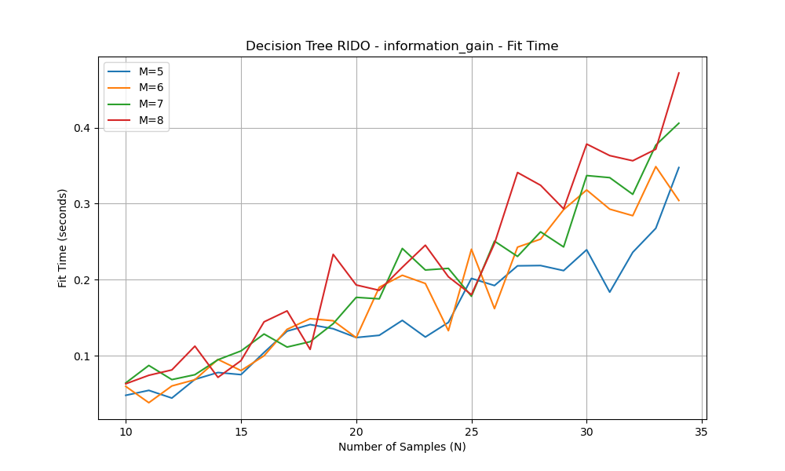

# Theoretical Time Complexity

**Symbols Used:**
1. M - number of attributes 
2. N - total number of samples 

The time complexity can be different depending on input types and whether the max_depth value is defined or not. 

## 1. Real Input

### For Creation
We divide the data table into two parts at each step without removing any columns, the worst-case scenario implies having a total of $(N-1)$ non-leaf nodes in the decision tree. Consequently, in the worst-case scenario, the code will execute a total of $N-1$ times. During each iteration, all columns in the table must be input into the information gain function to identify the column with the highest information gain for the appropriate split. This process repeats a total of $M$ times. The time complexity of the information gain function is $O(N^2)$, as it takes $O(N)$ to compute information for a given split, and there are $(N-1)$ splits. Consequently, each iteration has a time complexity of $O(N^2M)$. Therefore, the overall complexity for real inputs is $O(M \cdot N^3)$.

### For Prediction
In the worst-case scenario, predicting a sample input reaching the leaf at the lowest level, which corresponds to the depth of the tree, entails traversing through all $(N-1)$ splits. Therefore, the Prediction Time Complexity per input is $O(N)$. Given a test size of $N$, the overall prediction time becomes $O(N^2)$.

## 2. Discrete Input 

### For Creation
The total number of unique input samples, derived from the attributes, relies on the count of unique attribute values in each column, expressed as the product of all $(d_i)$ values. Consequently, the number of leaves in the decision tree is bounded by this value. Conversely, for a given number of output leaves N, the number of non-leaf nodes (decision nodes) cannot surpass $(N-1)$, as each node should either be a child node or undergo at least two splits. Given that the code runs as many times as the number of non-leaf nodes in the decision tree in the worst-case scenario, the total iterations amount to $min(D, N-1)$, where $D$ is the product of all $d_i$ values.

In scenarios where the product of all unique attributes from each column is less than the sample size $(N)$, the maximum number of leaves is determined by the product of all $(d_i)$ values. The sets of samples sharing the same value(s) for all attributes are grouped into a single leaf, resulting in a maximum iteration count one less than the number of leaves, equivalent to the product value.

On the other hand, if the product of all unique attributes from each column exceeds the sample size $(N)$, each sample could be unique, leading to a perfect classification with $N$ leaves. In this case, the internal nodes amount to $(N-1)$, and the maximum possible iterations become $(N-1)$, making it $O(N)$.

During each iteration, the code passes all columns in the table to the information gain function. Consequently, the information gain function is executed a total of $O(M)$ times in each iteration. The complexity of this function is proportional to the size of the input series, requiring two passes to calculate information gain. Thus, each iteration has a time complexity of $O(NM)$.
    
Therefore, the learning time complexity for discrete inputs is expressed as $O(min(D, N-1) \cdot (NM))$.

### For Prediction
The prediction time complexity in this scenario hinges on the depth of the tree. In the worst-case scenario, each of the $M$ attributes would act as a decision node along the path from the root to the leaf. Consequently, $M$ questions would be posed, and the depth of the tree would align with $M$. Thus, the prediction time complexity amounts to $O(M)$ per input. If the input test size is $N$, the overall prediction time becomes $O(M*N)$.

## All the Graphs

  
  

  
  

  
  

  
  

  
  

  
  

  
  

  
  

## Comparisons

### 1. Creation of Tree:

#### For Real Input
As we can see, the theoretical time complexity is $O(M \cdot N^3)$.
But, in the graph, the actual time complexity is increasing with an increase in the number of samples but also decreasing in-between. The reason can be that the different splits happening in the input data lead to different times at each stage of the algorithm. This means that the time complexity of the input data is different than the actual time complexity.

#### For Discrete Input
In discrete input scenarios, the specific values and categories within the dataset can lead to diverse outcomes at each stage of the algorithm. The discrete nature of the input may introduce specific patterns or structures that influence the time complexity differently compared to the theoretical expectation. Therefore, the graph illustrates that the actual time complexity on discrete input data deviates from the theoretical analysis. The impact of various splits and the specific characteristics of the discrete data play a significant role in determining the observed time complexity at different stages of the algorithm.

### 2. Prediction of Tree:

#### For Real Input
In the case of prediction of the output data, the theoretical and actual time complexity is varying. In the case of prediction of the data, the time is increasing with an increase in the number of samples and an increase in the number of features, but sometimes it also decreases with an increase in the number of samples. The theoretical time complexity provides an abstract estimation based on algorithmic analysis, assuming certain conditions and uniformities that might not fully align with the complexities present in real-world datasets. The observed fluctuations are a result of specific characteristics of the data. Certain configurations of samples or features can result in more complex decision paths, impacting the algorithm's efficiency differently.

#### For Discrete Input
The fluctuations observed in the prediction of a decision tree for discrete input, as reflected in the graph, can be attributed to a combination of factors. The specific characteristics of the discrete input data, such as the distribution of unique attribute values and their combinations, play a crucial role. The decision-making process within the algorithm is dynamic, and different attribute value configurations can lead to diverse decision paths, impacting the overall prediction time. Additionally, the inherent complexity of the dataset, including the number of attributes and unique values, interacts with the decision tree structure, creating scenarios where the algorithm's efficiency varies.
